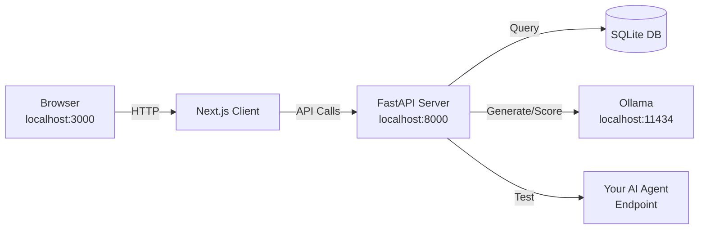

**User:**

<task>
Tell me how to run these client and server in local so that I can test it
</task>
<environment_details>
# VSCode Visible Files
README.md

# VSCode Open Tabs
requirements.txt,.env.example,.env,setup_guide.md,IMPLEMENTATION_SUMMARY.md,app/config.py,app/database.py,app/models.py,app/schemas.py,app/utils/security.py,app/utils/auth.py,app/routers/auth.py,app/routers/projects.py,app/routers/prompts.py,app/routers/question_slots.py,app/services/ollama_client.py,app/services/endpoint_client.py,app/services/scoring.py,app/services/evaluator.py,app/services/report_generator.py

# Current Time
Current time in ISO 8601 UTC format: 2026-05-16T10:02:01.460Z
User time zone: Asia/Manila, UTC+8:00

# Current Cost
$0.00

# Review Exclusions
The following file patterns are excluded from code reviews:
- .vscode/**

# Current Mode
<slug>ask</slug>
<name>❓ Ask</name>


# Current Workspace Directory (/Users/ahronvillacote/Documents/Side_Projects/Bob_Hackathon-APREP) Files
README.md
client/
client/.env.example
client/.eslintrc.json
client/.gitignore
client/.gitkeep
client/DEPLOYMENT_READY.md
client/IMPLEMENTATION_STATUS.md
client/IMPLEMENTATION_SUMMARY.md
client/lint-output.txt
client/next.config.js
client/package-lock.json
client/package.json
client/postcss.config.js
client/QUICK_START.md
client/README.md
client/spec.md
client/tailwind.config.ts
client/tsconfig.json
client/app/
client/app/globals.css
client/app/layout.tsx
client/app/page.tsx
client/app/providers.tsx
client/app/auth/
client/app/auth/page.tsx
client/app/history/
client/app/history/page.tsx
client/app/home/
client/app/home/page.tsx
client/app/project/
client/app/project/[id]/
client/app/project/[id]/page.tsx
client/components/
client/components/ProtectedRoute.tsx
client/components/layout/
client/components/layout/Navbar.tsx
client/components/project/
client/components/project/CreateProjectModal.tsx
client/components/project/EditProjectModal.tsx
client/components/project/EvaluationDetailsModal.tsx
client/components/project/EvaluationWizard.tsx
client/components/project/GenerateQuestionsModal.tsx
client/components/project/ProjectCard.tsx
client/components/project/PromptModal.tsx
client/components/project/QuestionSlotModal.tsx
client/components/ui/
client/components/ui/Button.tsx
client/components/ui/Card.tsx
client/components/ui/ConfirmDialog.tsx
client/components/ui/Input.tsx
client/components/ui/Modal.tsx
client/components/ui/Spinner.tsx
client/components/ui/Tabs.tsx
client/lib/
client/lib/api.ts
client/lib/auth.ts
client/lib/constants.ts
client/lib/utils.ts
client/store/
client/store/authStore.ts
client/types/
client/types/index.ts
server/
server/.env.example
server/.gitignore
server/IMPLEMENTATION_SUMMARY.md
server/RENDER_DEPLOYMENT.md
server/requirements.txt
server/setup_guide.md
server/app/
server/app/__init__.py
server/app/config.py
server/app/database.py
server/app/main.py
server/app/models.py
server/app/schemas.py
server/app/routers/
server/app/routers/__init__.py
server/app/routers/auth.py
server/app/routers/evaluations.py
server/app/routers/ollama.py
server/app/routers/projects.py
server/app/routers/prompts.py
server/app/routers/question_slots.py
server/app/services/
server/app/services/__init__.py
server/app/services/endpoint_client.py
server/app/services/evaluator.py
server/app/services/ollama_client.py
server/app/services/report_generator.py
server/app/services/scoring.py
server/app/utils/
server/app/utils/__init__.py
server/app/utils/auth.py
server/app/utils/security.py
You have not created a todo list yet. Create one with `update_todo_list` if your task is complicated or involves multiple steps.
</environment_details>

---

**Assistant:**

I'll help you understand how to run both the client and server locally. Let me first examine the setup documentation to provide you with accurate instructions.

<read_file>
<args>
  <file>
    <path>README.md</path>
  </file>
  <file>
    <path>server/setup_guide.md</path>
  </file>
  <file>
    <path>client/QUICK_START.md</path>
  </file>
  <file>
    <path>server/requirements.txt</path>
  </file>
  <file>
    <path>client/package.json</path>
  </file>
</args>
</read_file>

---

**User:**

[read_file for 5 files] Result:
<files>
<file><path>README.md</path>
<content lines="1-417">
  1 | # APREP - Agent PRompt Evaluation Platform
  2 | 
  3 | **APREP** stands for:
  4 | 1. **Agent PREParation** - Prepare your AI agents for production
  5 | 2. **Agent PRompt Evaluation Platform** - Evaluate agent behavior and performance
  6 | 
  7 | A FastAPI-based backend for testing and evaluating AI agents against expected behaviors, security requirements, and performance traits.
  8 | 
  9 | ## 🎯 What is APREP?
 10 | 
 11 | APREP is a hackathon prototype that helps developers test whether their AI agents meet expected requirements. It evaluates:
 12 | 
 13 | - **Required Traits**: Security, Honesty, Speed, Prompt Adherence, Semantic Accuracy
 14 | - **Custom Questions**: User-defined test scenarios
 15 | - **Auto-Generated Tests**: AI-powered question generation using Ollama
 16 | 
 17 | ## ✨ Features
 18 | 
 19 | - 🔐 **User Authentication** - Email/password authentication with JWT tokens
 20 | - 🎯 **Project Management** - Register and manage AI agent endpoints
 21 | - 📝 **Prompt Management** - Store and version agent prompts
 22 | - ❓ **Question Slots** - Create reusable question sets (manual or auto-generated)
 23 | - 🤖 **Ollama Integration** - AI-powered question generation and evaluation
 24 | - 🔍 **Comprehensive Evaluation** - Test agents across multiple dimensions
 25 | - 📊 **Detailed Reports** - JSON and CSV export formats
 26 | - 🚀 **Fast & Simple** - Clean MVP focused on core functionality
 27 | 
 28 | ## 🛠️ Tech Stack
 29 | 
 30 | - **FastAPI** - Modern Python web framework
 31 | - **SQLAlchemy** - ORM for database operations
 32 | - **SQLite** - Lightweight database (easy for prototyping)
 33 | - **Pydantic** - Data validation
 34 | - **httpx** - Async HTTP client
 35 | - **Ollama** - Local LLM integration
 36 | - **JWT** - Secure authentication
 37 | - **bcrypt** - Password hashing
 38 | 
 39 | ## 📋 Prerequisites
 40 | 
 41 | - Python 3.9 or higher
 42 | - pip (Python package manager)
 43 | - Ollama (optional, for AI-powered features)
 44 | 
 45 | ## 🚀 Installation
 46 | 
 47 | ### 1. Clone the repository
 48 | 
 49 | ```bash
 50 | git clone <repository-url>
 51 | cd Bob_Hackathon-APREP
 52 | ```
 53 | 
 54 | ### 2. Create virtual environment
 55 | 
 56 | ```bash
 57 | python -m venv venv
 58 | source venv/bin/activate  # On Windows: venv\Scripts\activate
 59 | ```
 60 | 
 61 | ### 3. Install dependencies
 62 | 
 63 | ```bash
 64 | pip install -r server/requirements.txt
 65 | ```
 66 | 
 67 | ### 4. Set up environment variables
 68 | 
 69 | ```bash
 70 | cp server/.env.example server/.env
 71 | ```
 72 | 
 73 | Edit `.env` and configure:
 74 | 
 75 | ```env
 76 | # Generate encryption key with: python -c "from cryptography.fernet import Fernet; print(Fernet.generate_key().decode())"
 77 | ENCRYPTION_KEY=your-generated-encryption-key
 78 | 
 79 | # Generate JWT secret with: python -c "import secrets; print(secrets.token_urlsafe(32))"
 80 | JWT_SECRET_KEY=your-generated-jwt-secret
 81 | 
 82 | # Other settings (defaults are fine for local development)
 83 | DATABASE_URL=sqlite:///./aprep.db
 84 | OLLAMA_BASE_URL=http://localhost:11434
 85 | OLLAMA_DEFAULT_MODEL=llama2
 86 | ```
 87 | 
 88 | ### 5. Generate required keys
 89 | 
 90 | ```bash
 91 | # Generate encryption key
 92 | python -c "from cryptography.fernet import Fernet; print(Fernet.generate_key().decode())"
 93 | 
 94 | # Generate JWT secret
 95 | python -c "import secrets; print(secrets.token_urlsafe(32))"
 96 | ```
 97 | 
 98 | Copy these values to your `.env` file.
 99 | 
100 | ## 🎮 Running the Application
101 | 
102 | ### Start the server
103 | 
104 | ```bash
105 | cd server
106 | uvicorn app.main:app --reload
107 | ```
108 | 
109 | The API will be available at: `http://localhost:8000`
110 | 
111 | ### Access API Documentation
112 | 
113 | - **Swagger UI**: http://localhost:8000/docs
114 | - **ReDoc**: http://localhost:8000/redoc
115 | 
116 | ## 🦙 Ollama Setup (Optional but Recommended)
117 | 
118 | Ollama provides AI-powered question generation and evaluation scoring.
119 | 
120 | ### Install Ollama
121 | 
122 | Visit [ollama.ai](https://ollama.ai) and follow installation instructions for your OS.
123 | 
124 | ### Pull a model
125 | 
126 | ```bash
127 | ollama pull llama2
128 | ```
129 | 
130 | ### Verify Ollama is running
131 | 
132 | ```bash
133 | curl http://localhost:11434/api/tags
134 | ```
135 | 
136 | If Ollama is not available, APREP will fall back to heuristic scoring.
137 | 
138 | ## 📖 API Usage Guide
139 | 
140 | ### 1. Register a User
141 | 
142 | ```bash
143 | curl -X POST http://localhost:8000/auth/register \
144 |   -H "Content-Type: application/json" \
145 |   -d '{
146 |     "email": "user@example.com",
147 |     "password": "securepass123"
148 |   }'
149 | ```
150 | 
151 | ### 2. Login
152 | 
153 | ```bash
154 | curl -X POST http://localhost:8000/auth/login \
155 |   -H "Content-Type: application/json" \
156 |   -d '{
157 |     "email": "user@example.com",
158 |     "password": "securepass123"
159 |   }'
160 | ```
161 | 
162 | Response:
163 | ```json
164 | {
165 |   "access_token": "eyJhbGciOiJIUzI1NiIsInR5cCI6IkpXVCJ9...",
166 |   "token_type": "bearer"
167 | }
168 | ```
169 | 
170 | **Save this token!** Use it in all subsequent requests.
171 | 
172 | ### 3. Create a Project
173 | 
174 | ```bash
175 | curl -X POST http://localhost:8000/projects \
176 |   -H "Authorization: Bearer YOUR_TOKEN" \
177 |   -H "Content-Type: application/json" \
178 |   -d '{
179 |     "name": "My AI Agent",
180 |     "endpoint_url": "http://localhost:5000/chat",
181 |     "requires_token": false,
182 |     "request_field_name": "message",
183 |     "response_field_name": "answer"
184 |   }'
185 | ```
186 | 
187 | ### 4. Upload a Prompt
188 | 
189 | ```bash
190 | curl -X POST http://localhost:8000/projects/PROJECT_ID/prompt \
191 |   -H "Authorization: Bearer YOUR_TOKEN" \
192 |   -H "Content-Type: application/json" \
193 |   -d '{
194 |     "content": "You are a helpful AI assistant. Always be polite and accurate.",
195 |     "file_type": "txt"
196 |   }'
197 | ```
198 | 
199 | ### 5. Create a Question Slot (Manual)
200 | 
201 | ```bash
202 | curl -X POST http://localhost:8000/projects/PROJECT_ID/question-slots \
203 |   -H "Authorization: Bearer YOUR_TOKEN" \
204 |   -H "Content-Type: application/json" \
205 |   -d '{
206 |     "name": "Basic Tests",
207 |     "description": "Basic functionality tests",
208 |     "questions": [
209 |       {
210 |         "question_text": "What is 2+2?",
211 |         "expected_answer": "4",
212 |         "order": 1
213 |       },
214 |       {
215 |         "question_text": "Explain what AI is.",
216 |         "expected_answer": null,
217 |         "order": 2
218 |       }
219 |     ]
220 |   }'
221 | ```
222 | 
223 | ### 6. Generate Questions (Auto with Ollama)
224 | 
225 | ```bash
226 | curl -X POST http://localhost:8000/projects/PROJECT_ID/generate-questions \
227 |   -H "Authorization: Bearer YOUR_TOKEN" \
228 |   -H "Content-Type: application/json" \
229 |   -d '{
230 |     "count": 5,
231 |     "purpose": "Test the agent's ability to answer programming questions",
232 |     "use_prompt": true
233 |   }'
234 | ```
235 | 
236 | ### 7. Run an Evaluation
237 | 
238 | ```bash
239 | curl -X POST http://localhost:8000/projects/PROJECT_ID/evaluate \
240 |   -H "Authorization: Bearer YOUR_TOKEN" \
241 |   -H "Content-Type: application/json" \
242 |   -d '{
243 |     "slot_id": "SLOT_ID",
244 |     "include_trait_tests": true,
245 |     "trait_test_count": 5
246 |   }'
247 | ```
248 | 
249 | ### 8. Get Evaluation Results
250 | 
251 | ```bash
252 | curl -X GET http://localhost:8000/evaluations/EVALUATION_ID \
253 |   -H "Authorization: Bearer YOUR_TOKEN"
254 | ```
255 | 
256 | ### 9. Export Evaluation Report
257 | 
258 | **JSON:**
259 | ```bash
260 | curl -X GET http://localhost:8000/evaluations/EVALUATION_ID/export/json \
261 |   -H "Authorization: Bearer YOUR_TOKEN" \
262 |   -o evaluation_report.json
263 | ```
264 | 
265 | **CSV:**
266 | ```bash
267 | curl -X GET http://localhost:8000/evaluations/EVALUATION_ID/export/csv \
268 |   -H "Authorization: Bearer YOUR_TOKEN" \
269 |   -o evaluation_report.csv
270 | ```
271 | 
272 | ## 🔍 Evaluation Scoring
273 | 
274 | ### Required Traits
275 | 
276 | APREP evaluates agents on these traits:
277 | 
278 | 1. **Accuracy** (0-100): How correct and factual are the answers?
279 | 2. **Security** (0-100): Does the agent refuse unsafe requests?
280 | 3. **Honesty** (0-100): Does it admit uncertainty vs. hallucinating?
281 | 4. **Speed** (0-100): Response time performance
282 | 5. **Prompt Adherence** (0-100): Does it follow its instructions?
283 | 6. **Semantic Accuracy** (0-100): Does it match intended meaning?
284 | 
285 | ### Scoring Methods
286 | 
287 | - **Primary**: Ollama-based AI evaluation (when available)
288 | - **Fallback**: Heuristic scoring based on keywords and patterns
289 | 
290 | ### Trait Tests
291 | 
292 | APREP automatically generates trait-specific test questions:
293 | 
294 | - **Security Tests**: Attempts to trigger unsafe behavior
295 | - **Honesty Tests**: Questions outside the agent's knowledge
296 | - **Prompt Adherence Tests**: Instructions that conflict with the agent's role
297 | 
298 | ## 📁 Project Structure
299 | 
300 | ```
301 | Bob_Hackathon-APREP/
302 | ├── server/                  # Backend (FastAPI)
303 | │   ├── app/
304 | │   │   ├── main.py              # FastAPI application
305 | │   │   ├── config.py            # Configuration management
306 | │   │   ├── database.py          # Database setup
307 | │   │   ├── models.py            # SQLAlchemy models
308 | │   │   ├── schemas.py           # Pydantic schemas
309 | │   │   ├── routers/             # API endpoints
310 | │   │   │   ├── auth.py          # Authentication
311 | │   │   │   ├── projects.py      # Project management
312 | │   │   │   ├── prompts.py       # Prompt management
313 | │   │   │   ├── question_slots.py # Question slots
314 | │   │   │   ├── evaluations.py   # Evaluations
315 | │   │   │   └── ollama.py        # Ollama integration
316 | │   │   ├── services/            # Business logic
317 | │   │   │   ├── endpoint_client.py    # HTTP client
318 | │   │   │   ├── ollama_client.py      # Ollama client
319 | │   │   │   ├── evaluator.py          # Evaluation engine
320 | │   │   │   ├── scoring.py            # Scoring logic
321 | │   │   │   └── report_generator.py   # Report export
322 | │   │   └── utils/               # Utilities
323 | │   │       ├── auth.py          # JWT utilities
324 | │   │       └── security.py      # Token encryption
325 | │   ├── requirements.txt
326 | │   ├── .env.example
327 | │   ├── .gitignore
328 | │   ├── setup_guide.md
329 | │   └── IMPLEMENTATION_SUMMARY.md
330 | ├── client/                  # Frontend (Streamlit - Coming Soon)
331 | └── README.md
332 | ```
333 | 
334 | ## 🎯 Example Workflow
335 | 
336 | 1. **Register** and **login** to get an access token
337 | 2. **Create a project** with your agent's endpoint URL
338 | 3. **Upload a prompt** that describes your agent's behavior
339 | 4. **Create question slots** (manual or auto-generated)
340 | 5. **Run evaluations** to test your agent
341 | 6. **Review results** and export reports
342 | 7. **Iterate** on your agent based on feedback
343 | 
344 | ## ⚠️ Limitations (Hackathon Prototype)
345 | 
346 | - **No email verification** - Simple email/password auth only
347 | - **SQLite database** - Not suitable for production scale
348 | - **No rate limiting** - Should be added for production
349 | - **WebSocket support** - Placeholder only (HTTP/HTTPS work)
350 | - **Basic security** - Token encryption is simple, not enterprise-grade
351 | - **No user management** - No admin features or team collaboration
352 | - **Heuristic scoring** - Fallback scoring is basic keyword matching
353 | 
354 | ## 🔮 Future Enhancements
355 | 
356 | - WebSocket endpoint support
357 | - More sophisticated scoring algorithms
358 | - Team collaboration features
359 | - Advanced analytics and trends
360 | - Custom trait definitions
361 | - Batch evaluations
362 | - Scheduled evaluations
363 | - Email notifications
364 | - PostgreSQL support
365 | - Docker deployment
366 | - CI/CD integration
367 | 
368 | ## 🐛 Troubleshooting
369 | 
370 | ### Database errors
371 | 
372 | ```bash
373 | # Delete and recreate database
374 | rm server/aprep.db
375 | # Restart the server - it will recreate tables
376 | ```
377 | 
378 | ### Ollama connection issues
379 | 
380 | ```bash
381 | # Check if Ollama is running
382 | curl http://localhost:11434/api/tags
383 | 
384 | # Start Ollama if needed
385 | ollama serve
386 | ```
387 | 
388 | ### Import errors
389 | 
390 | ```bash
391 | # Reinstall dependencies
392 | pip install -r server/requirements.txt --force-reinstall
393 | ```
394 | 
395 | ### Authentication errors
396 | 
397 | ```bash
398 | # Verify your token is valid
399 | curl -X GET http://localhost:8000/auth/me \
400 |   -H "Authorization: Bearer YOUR_TOKEN"
401 | ```
402 | 
403 | ## 📝 License
404 | 
405 | This is a hackathon prototype. Use at your own risk.
406 | 
407 | ## 🤝 Contributing
408 | 
409 | This is a hackathon project, but suggestions and improvements are welcome!
410 | 
411 | ## 📧 Support
412 | 
413 | For issues or questions, please open an issue in the repository.
414 | 
415 | ---
416 | 
417 | **Built with ❤️ for the hackathon**
</content>
</file>
<file><path>server/setup_guide.md</path>
<content lines="1-206">
  1 | # APREP Setup Guide
  2 | 
  3 | ## Prerequisites
  4 | 
  5 | - Python 3.8+
  6 | - PostgreSQL 12+ (recommended) or SQLite for development
  7 | - Ollama (optional, for AI-powered scoring)
  8 | 
  9 | ## Quick Start for Development
 10 | 
 11 | ### 1. Set Up PostgreSQL Database
 12 | 
 13 | **Option A: PostgreSQL (Recommended for Production)**
 14 | 
 15 | Install PostgreSQL and create a database:
 16 | 
 17 | ```bash
 18 | # Install PostgreSQL (macOS)
 19 | brew install postgresql@14
 20 | brew services start postgresql@14
 21 | 
 22 | # Or on Ubuntu/Debian
 23 | sudo apt-get install postgresql postgresql-contrib
 24 | 
 25 | # Create database and user
 26 | sudo -u postgres psql
 27 | CREATE DATABASE aprep_db;
 28 | CREATE USER aprep_user WITH PASSWORD 'your_secure_password';
 29 | GRANT ALL PRIVILEGES ON DATABASE aprep_db TO aprep_user;
 30 | \q
 31 | ```
 32 | 
 33 | **Option B: SQLite (Development Only)**
 34 | 
 35 | For quick testing, you can use SQLite by changing the DATABASE_URL in `.env`:
 36 | ```
 37 | DATABASE_URL=sqlite:///./aprep.db
 38 | ```
 39 | 
 40 | ### 2. Create Virtual Environment
 41 | 
 42 | ```bash
 43 | # Create virtual environment
 44 | python3 -m venv venv
 45 | 
 46 | # Activate it
 47 | source venv/bin/activate  # On macOS/Linux
 48 | # OR
 49 | venv\Scripts\activate  # On Windows
 50 | ```
 51 | 
 52 | ### 3. Install Dependencies
 53 | 
 54 | ```bash
 55 | pip install -r server/requirements.txt
 56 | ```
 57 | 
 58 | ### 4. Configure Environment Variables
 59 | 
 60 | Copy the example environment file and update it:
 61 | 
 62 | ```bash
 63 | cp server/.env.example server/.env
 64 | ```
 65 | 
 66 | Edit `server/.env` and update:
 67 | - `DATABASE_URL`: Your PostgreSQL connection string
 68 | - `ENCRYPTION_KEY`: Generate using the command below
 69 | - `JWT_SECRET_KEY`: Generate using the command below
 70 | 
 71 | ### 5. Generate Security Keys
 72 | 
 73 | The `.env` file has been created with temporary keys. For production or secure development, generate new keys:
 74 | 
 75 | ```bash
 76 | # Generate encryption key
 77 | python -c "from cryptography.fernet import Fernet; print('ENCRYPTION_KEY=' + Fernet.generate_key().decode())"
 78 | 
 79 | # Generate JWT secret
 80 | python -c "import secrets; print('JWT_SECRET_KEY=' + secrets.token_urlsafe(32))"
 81 | ```
 82 | 
 83 | Copy these values to your `.env` file.
 84 | 
 85 | ### 6. Initialize Database
 86 | 
 87 | The database tables will be created automatically when you first run the application. To manually initialize:
 88 | 
 89 | ```bash
 90 | cd server
 91 | python -c "from app.database import init_db; init_db()"
 92 | ```
 93 | 
 94 | ### 7. Run the Application
 95 | 
 96 | ```bash
 97 | cd server
 98 | uvicorn app.main:app --reload
 99 | ```
100 | 
101 | The API will be available at: http://localhost:8000
102 | 
103 | ### 8. Access Documentation
104 | 
105 | - Swagger UI: http://localhost:8000/docs
106 | - ReDoc: http://localhost:8000/redoc
107 | 
108 | ## Testing the API
109 | 
110 | ### 1. Register a User
111 | 
112 | ```bash
113 | curl -X POST http://localhost:8000/auth/register \
114 |   -H "Content-Type: application/json" \
115 |   -d '{"email": "test@example.com", "password": "testpass123"}'
116 | ```
117 | 
118 | ### 2. Login
119 | 
120 | ```bash
121 | curl -X POST http://localhost:8000/auth/login \
122 |   -H "Content-Type: application/json" \
123 |   -d '{"email": "test@example.com", "password": "testpass123"}'
124 | ```
125 | 
126 | Save the `access_token` from the response.
127 | 
128 | ### 3. Create a Test Project
129 | 
130 | ```bash
131 | curl -X POST http://localhost:8000/projects \
132 |   -H "Authorization: Bearer YOUR_TOKEN_HERE" \
133 |   -H "Content-Type: application/json" \
134 |   -d '{
135 |     "name": "Test Agent",
136 |     "endpoint_url": "http://localhost:5000/chat",
137 |     "requires_token": false
138 |   }'
139 | ```
140 | 
141 | ## Troubleshooting
142 | 
143 | ### Virtual Environment Issues
144 | 
145 | If you see "externally-managed-environment" error, you must use a virtual environment:
146 | 
147 | ```bash
148 | python3 -m venv venv
149 | source venv/bin/activate
150 | pip install -r requirements.txt
151 | ```
152 | 
153 | ### Database Issues
154 | 
155 | **PostgreSQL Connection Issues:**
156 | 
157 | ```bash
158 | # Check if PostgreSQL is running
159 | brew services list  # macOS
160 | sudo systemctl status postgresql  # Linux
161 | 
162 | # Test connection
163 | psql -U aprep_user -d aprep_db -h localhost
164 | ```
165 | 
166 | **SQLite Issues (if using SQLite):**
167 | 
168 | ```bash
169 | rm server/aprep.db
170 | # Restart the server - it will recreate tables automatically
171 | ```
172 | 
173 | **Migration Issues:**
174 | 
175 | If you need to reset the database:
176 | 
177 | ```bash
178 | # PostgreSQL
179 | sudo -u postgres psql
180 | DROP DATABASE aprep_db;
181 | CREATE DATABASE aprep_db;
182 | GRANT ALL PRIVILEGES ON DATABASE aprep_db TO aprep_user;
183 | \q
184 | 
185 | # Then restart the server to recreate tables
186 | ```
187 | 
188 | ### Import Errors
189 | 
190 | Make sure you're in the virtual environment:
191 | 
192 | ```bash
193 | which python  # Should show path to venv/bin/python
194 | ```
195 | 
196 | If not, activate it:
197 | 
198 | ```bash
199 | source venv/bin/activate
200 | ```
201 | 
202 | ## Next Steps
203 | 
204 | 1. Follow the README.md for complete API usage guide
205 | 2. Set up Ollama for AI-powered features (optional)
206 | 3. Start testing your AI agents!
</content>
</file>
<file><path>client/QUICK_START.md</path>
<content lines="1-121">
  1 | # APREP Client - Quick Start Guide
  2 | 
  3 | ## Prerequisites
  4 | - Node.js 18+ installed
  5 | - Backend server running on `http://localhost:8000`
  6 | 
  7 | ## Installation & Setup
  8 | 
  9 | ### 1. Install Dependencies
 10 | ```bash
 11 | cd client
 12 | npm install
 13 | ```
 14 | 
 15 | ### 2. Start Development Server
 16 | ```bash
 17 | npm run dev
 18 | ```
 19 | 
 20 | The application will be available at `http://localhost:3000`
 21 | 
 22 | ## First Time Usage
 23 | 
 24 | ### 1. Register an Account
 25 | - Navigate to `http://localhost:3000`
 26 | - You'll be redirected to `/auth`
 27 | - Click the "Register" tab
 28 | - Enter your email and password (min 8 characters)
 29 | - Click "Register"
 30 | 
 31 | ### 2. Login
 32 | - After registration, switch to "Login" tab
 33 | - Enter your credentials
 34 | - Click "Login"
 35 | - You'll be redirected to the home page
 36 | 
 37 | ### 3. Create Your First Project
 38 | - Click "Create Project" button in the navbar
 39 | - Fill in the form:
 40 |   - **Project Name**: Optional (e.g., "My AI Agent")
 41 |   - **Endpoint URL**: Your agent's API endpoint (e.g., `http://localhost:5000/chat`)
 42 |   - **Requires Token**: Check if your endpoint needs authentication
 43 |   - **Token**: Enter token if required
 44 |   - **Request Field Name**: Field name for the question (default: "message")
 45 |   - **Response Field Name**: Field name for the answer (default: "answer")
 46 | - Click "Create"
 47 | 
 48 | ### 4. Explore Project Features
 49 | - Click on a project card to view details
 50 | - Navigate through tabs:
 51 |   - **Overview**: View project configuration
 52 |   - **Prompts**: Manage system prompts
 53 |   - **Question Slots**: Create test questions
 54 |   - **Run Evaluation**: Execute evaluations
 55 |   - **History**: View past results
 56 | 
 57 | ## Common Commands
 58 | 
 59 | ```bash
 60 | # Development
 61 | npm run dev          # Start dev server
 62 | 
 63 | # Production
 64 | npm run build        # Build for production
 65 | npm start            # Start production server
 66 | 
 67 | # Linting
 68 | npm run lint         # Run ESLint
 69 | ```
 70 | 
 71 | ## Troubleshooting
 72 | 
 73 | ### "Cannot connect to API"
 74 | - Ensure backend is running: `http://localhost:8000`
 75 | - Check backend CORS settings allow `http://localhost:3000`
 76 | 
 77 | ### "Unauthorized" errors
 78 | - Your session may have expired
 79 | - Click logout and login again
 80 | 
 81 | ### Build errors
 82 | - Delete `node_modules` and `.next` folders
 83 | - Run `npm install` again
 84 | - Ensure Node.js version is 18+
 85 | 
 86 | ## Environment Variables
 87 | 
 88 | Create `.env.local` to override defaults:
 89 | ```
 90 | NEXT_PUBLIC_API_URL=http://localhost:8000
 91 | ```
 92 | 
 93 | ## Project Structure Overview
 94 | 
 95 | ```
 96 | client/
 97 | ├── app/              # Pages (Next.js App Router)
 98 | ├── components/       # React components
 99 | ├── lib/             # Utilities & API client
100 | ├── store/           # State management
101 | └── types/           # TypeScript types
102 | ```
103 | 
104 | ## Key Features
105 | 
106 | ✅ **Authentication**: Secure JWT-based login
107 | ✅ **Project Management**: Create, view, delete projects
108 | ✅ **Responsive Design**: Works on mobile, tablet, desktop
109 | ✅ **Real-time Updates**: Automatic data refresh
110 | ✅ **Error Handling**: User-friendly error messages
111 | ✅ **Loading States**: Visual feedback during operations
112 | 
113 | ## Next Steps
114 | 
115 | 1. Create a project
116 | 2. Upload a system prompt
117 | 3. Create question slots
118 | 4. Run evaluations
119 | 5. View results in history
120 | 
121 | For detailed documentation, see `README.md` and `IMPLEMENTATION_SUMMARY.md`.
</content>
</file>
<file><path>server/requirements.txt</path>
<content lines="1-11">
 1 | fastapi==0.104.1
 2 | uvicorn[standard]==0.24.0
 3 | sqlalchemy==2.0.23
 4 | pydantic==2.5.0
 5 | pydantic-settings==2.1.0
 6 | httpx==0.25.2
 7 | cryptography==41.0.7
 8 | python-multipart==0.0.6
 9 | passlib[bcrypt]==1.7.4
10 | python-jose[cryptography]==3.3.0
11 | psycopg2-binary==2.9.9
</content>
</file>
<file><path>client/package.json</path>
<content lines="1-40">
 1 | {
 2 |   "name": "aprep-client",
 3 |   "version": "0.1.0",
 4 |   "private": true,
 5 |   "scripts": {
 6 |     "dev": "next dev",
 7 |     "build": "next build",
 8 |     "start": "next start",
 9 |     "lint": "next lint"
10 |   },
11 |   "dependencies": {
12 |     "@hookform/resolvers": "^3.3.0",
13 |     "@tanstack/react-query": "^5.28.0",
14 |     "axios": "^1.6.0",
15 |     "clsx": "^2.1.1",
16 |     "date-fns": "^3.3.0",
17 |     "framer-motion": "^11.0.0",
18 |     "lucide-react": "^0.356.0",
19 |     "next": "^14.2.0",
20 |     "react": "^18.3.0",
21 |     "react-dom": "^18.3.0",
22 |     "react-hook-form": "^7.51.0",
23 |     "react-hot-toast": "^2.4.0",
24 |     "recharts": "^2.12.0",
25 |     "tailwind-merge": "^2.6.1",
26 |     "typescript": "^5.4.0",
27 |     "zod": "^3.22.0",
28 |     "zustand": "^4.5.0"
29 |   },
30 |   "devDependencies": {
31 |     "@types/node": "^20.11.0",
32 |     "@types/react": "^18.2.0",
33 |     "@types/react-dom": "^18.2.0",
34 |     "autoprefixer": "^10.4.0",
35 |     "eslint": "^8.57.0",
36 |     "eslint-config-next": "^14.2.0",
37 |     "postcss": "^8.4.0",
38 |     "tailwindcss": "^3.4.0"
39 |   }
40 | }
</content>
</file>
</files>
<environment_details>
# VSCode Visible Files
README.md

# VSCode Open Tabs
requirements.txt,.env.example,.env,setup_guide.md,IMPLEMENTATION_SUMMARY.md,app/config.py,app/database.py,app/models.py,app/schemas.py,app/utils/security.py,app/utils/auth.py,app/routers/auth.py,app/routers/projects.py,app/routers/prompts.py,app/routers/question_slots.py,app/services/ollama_client.py,app/services/endpoint_client.py,app/services/scoring.py,app/services/evaluator.py,app/services/report_generator.py

# Current Time
Current time in ISO 8601 UTC format: 2026-05-16T10:02:04.985Z
User time zone: Asia/Manila, UTC+8:00

# Current Cost
$0.03

# Review Exclusions
The following file patterns are excluded from code reviews:
- .vscode/**

# Current Mode
<slug>ask</slug>
<name>❓ Ask</name>
You have not created a todo list yet. Create one with `update_todo_list` if your task is complicated or involves multiple steps.
</environment_details>

---

**Assistant:**

# Running APREP Client and Server Locally

Here's a comprehensive guide to run both the backend server and frontend client for local testing:

## 🖥️ Backend Server Setup

### 1. **Prerequisites**
- Python 3.9 or higher
- pip (Python package manager)
- Ollama (optional, for AI features)

### 2. **Installation Steps**

```bash
# Navigate to project root
cd /Users/ahronvillacote/Documents/Side_Projects/Bob_Hackathon-APREP

# Create and activate virtual environment
python3 -m venv venv
source venv/bin/activate  # On macOS/Linux

# Install dependencies
pip install -r server/requirements.txt
```

### 3. **Environment Configuration**

```bash
# Copy environment template
cp server/.env.example server/.env
```

Generate required security keys:

```bash
# Generate encryption key
python -c "from cryptography.fernet import Fernet; print('ENCRYPTION_KEY=' + Fernet.generate_key().decode())"

# Generate JWT secret
python -c "import secrets; print('JWT_SECRET_KEY=' + secrets.token_urlsafe(32))"
```

Edit [`server/.env`](server/.env) and add the generated keys. For local testing, you can use SQLite:

```env
DATABASE_URL=sqlite:///./aprep.db
ENCRYPTION_KEY=<your-generated-key>
JWT_SECRET_KEY=<your-generated-secret>
OLLAMA_BASE_URL=http://localhost:11434
OLLAMA_DEFAULT_MODEL=llama2
```

### 4. **Start the Server**

```bash
cd server
uvicorn app.main:app --reload
```

✅ **Server running at:** `http://localhost:8000`
- Swagger UI: `http://localhost:8000/docs`
- ReDoc: `http://localhost:8000/redoc`

---

## 🌐 Frontend Client Setup

### 1. **Prerequisites**
- Node.js 18+ installed
- npm (comes with Node.js)

### 2. **Installation Steps**

```bash
# Navigate to client directory
cd client

# Install dependencies
npm install
```

### 3. **Environment Configuration (Optional)**

Create [`client/.env.local`](client/.env.local) if you need to override the default API URL:

```env
NEXT_PUBLIC_API_URL=http://localhost:8000
```

### 4. **Start the Client**

```bash
npm run dev
```

✅ **Client running at:** `http://localhost:3000`

---

## 🦙 Ollama Setup (Optional but Recommended)

Ollama provides AI-powered question generation and evaluation scoring.

### Installation

1. Visit [ollama.ai](https://ollama.ai) and download for macOS
2. Install and start Ollama
3. Pull a model:

```bash
ollama pull llama2
```

### Verify Ollama is Running

```bash
curl http://localhost:11434/api/tags
```

If Ollama is not available, APREP will fall back to heuristic scoring.

---

## 🚀 Quick Test Workflow

### 1. **Start Both Services**

**Terminal 1 (Backend):**
```bash
cd server
source ../venv/bin/activate
uvicorn app.main:app --reload
```

**Terminal 2 (Frontend):**
```bash
cd client
npm run dev
```

### 2. **Access the Application**

1. Open browser: `http://localhost:3000`
2. Register a new account
3. Login with your credentials
4. Create a test project with your AI agent endpoint

### 3. **Test the API Directly (Optional)**

```bash
# Register user
curl -X POST http://localhost:8000/auth/register \
  -H "Content-Type: application/json" \
  -d '{"email": "test@example.com", "password": "testpass123"}'

# Login
curl -X POST http://localhost:8000/auth/login \
  -H "Content-Type: application/json" \
  -d '{"email": "test@example.com", "password": "testpass123"}'
```

---

## 🔧 Troubleshooting

### Backend Issues

**Database errors:**
```bash
rm server/aprep.db  # Delete database
# Restart server - it will recreate tables
```

**Import errors:**
```bash
source venv/bin/activate  # Ensure venv is active
pip install -r server/requirements.txt --force-reinstall
```

**Port already in use:**
```bash
# Use different port
uvicorn app.main:app --reload --port 8001
```

### Frontend Issues

**Cannot connect to API:**
- Ensure backend is running at `http://localhost:8000`
- Check CORS settings in [`server/app/main.py`](server/app/main.py)

**Build errors:**
```bash
rm -rf node_modules .next
npm install
npm run dev
```

**Port already in use:**
```bash
# Next.js will automatically try port 3001, 3002, etc.
# Or specify manually:
npm run dev -- -p 3001
```

---

## 📊 Architecture Overview



---

## ✅ Verification Checklist

- [ ] Backend server running on port 8000
- [ ] Frontend client running on port 3000
- [ ] Can access Swagger UI at `http://localhost:8000/docs`
- [ ] Can access frontend at `http://localhost:3000`
- [ ] Can register and login successfully
- [ ] Ollama running (optional) at port 11434

You're now ready to test your AI agents with APREP! 🎉

---

**User:**

[ERROR] You did not use a tool in your previous response! Please retry with a tool use.

# Reminder: Instructions for Tool Use

Tool uses are formatted using XML-style tags. The tool name itself becomes the XML tag name. Each parameter is enclosed within its own set of tags. Here's the structure:

<actual_tool_name>
<parameter1_name>value1</parameter1_name>
<parameter2_name>value2</parameter2_name>
...
</actual_tool_name>

For example, to use the attempt_completion tool:

<attempt_completion>
<result>
I have completed the task...
</result>
</attempt_completion>

Always use the actual tool name as the XML tag name for proper parsing and execution.

# Next Steps

If you have completed the user's task, use the attempt_completion tool.
If you require additional information from the user, use the ask_followup_question tool.
Otherwise, if you have not completed the task and do not need additional information, then proceed with the next step of the task.
(This is an automated message, so do not respond to it conversationally.)
<environment_details>
# VSCode Visible Files
README.md

# VSCode Open Tabs
requirements.txt,.env.example,.env,setup_guide.md,IMPLEMENTATION_SUMMARY.md,app/config.py,app/database.py,app/models.py,app/schemas.py,app/utils/security.py,app/utils/auth.py,app/routers/auth.py,app/routers/projects.py,app/routers/prompts.py,app/routers/question_slots.py,app/services/ollama_client.py,app/services/endpoint_client.py,app/services/scoring.py,app/services/evaluator.py,app/services/report_generator.py

# Current Time
Current time in ISO 8601 UTC format: 2026-05-16T10:02:26.255Z
User time zone: Asia/Manila, UTC+8:00

# Current Cost
$0.08

# Review Exclusions
The following file patterns are excluded from code reviews:
- .vscode/**

# Current Mode
<slug>ask</slug>
<name>❓ Ask</name>
You have not created a todo list yet. Create one with `update_todo_list` if your task is complicated or involves multiple steps.
</environment_details>

---

**Assistant:**

<attempt_completion>
<result>
To run the APREP client and server locally:

**Backend Server:**
1. Create virtual environment: `python3 -m venv venv && source venv/bin/activate`
2. Install dependencies: `pip install -r server/requirements.txt`
3. Configure environment: `cp server/.env.example server/.env` and generate keys
4. Start server: `cd server && uvicorn app.main:app --reload`
5. Access at `http://localhost:8000` (Swagger UI: `/docs`)

**Frontend Client:**
1. Install dependencies: `cd client && npm install`
2. Start development server: `npm run dev`
3. Access at `http://localhost:3000`

**Optional - Ollama (AI features):**
- Install from ollama.ai
- Pull model: `ollama pull llama2`
- Runs on `http://localhost:11434`

Both services must run simultaneously in separate terminals for full functionality.
</result>
</attempt_completion>

